# Lab6web
untuk memenuhi tugas pemogramman web

Nama    : Antini permatasari 
NIM     : 312010095 
Kelas   : TI.20.B.1 

## pratikum 6 
## 1.Langkah pertama kita harus membuat Lab6web didalam folder itu kita harus terdapat 2 folder. 
yaitu : Gambar untuk menyimpan screenshot dan Lab6_css_framework untuk folder bootstrap.html dan css. 
Selanjutnya kita akan membuat htmlnya: 
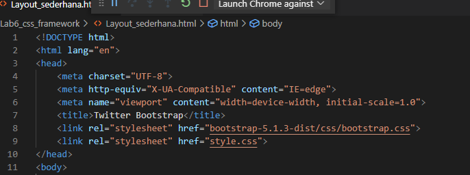 
## 2.Dan selanjunya kita membuka file explorer dan kita lihat gambarnya seperti dibawah ini: 
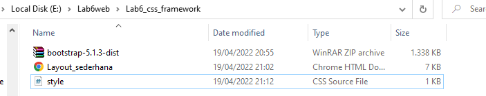 
lalu kita tambahkan header dan juga navbarnya seperti dibawah ini : 
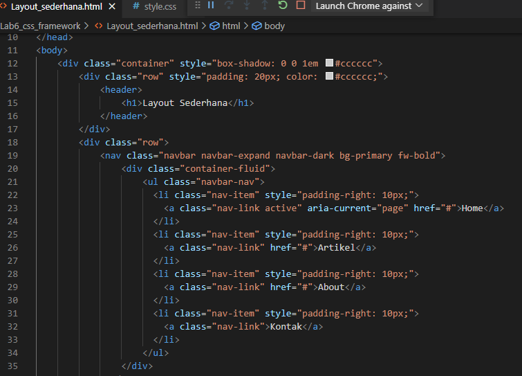 
Maka hasilnya akan seperti ini: 
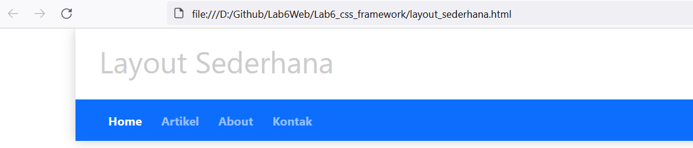 
Lalu kita akan membuat heronya seperti ini: 
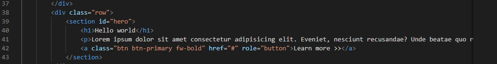 
Maka hasilnya akan seperti ini : 
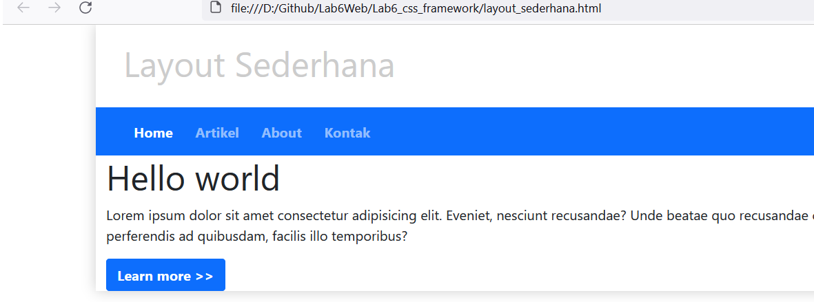 
## 3.Selanjunya kita membuat html cssnya seperti ini: 
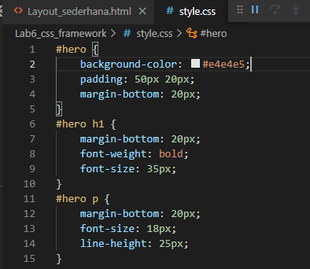 
kemudian kita tambahkan link pada bagian bawah boostrap seperti dibawah ini: 
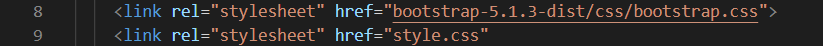 
Maka kita lihat hasilnya ini: 
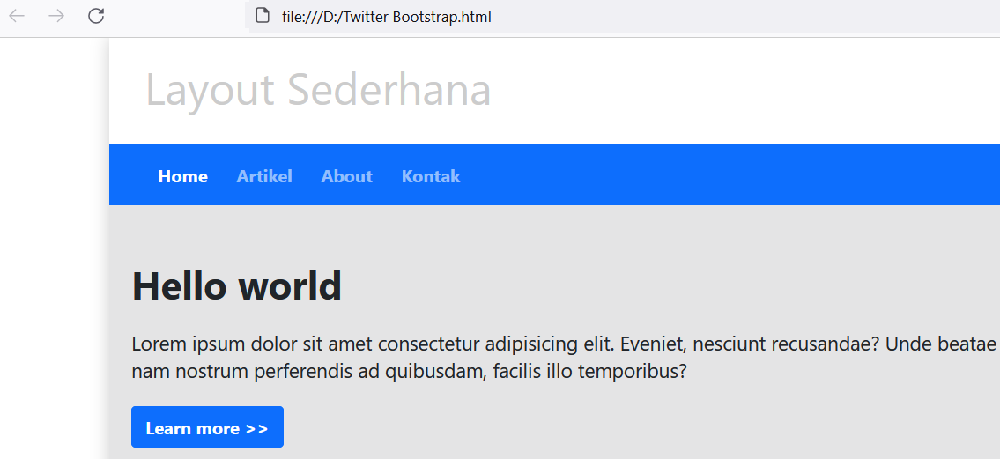 
## 4.Selanjunya kita akan menambahkan 3 buah Lingkaran 
dan kita buat htmlnya seperti ini: 
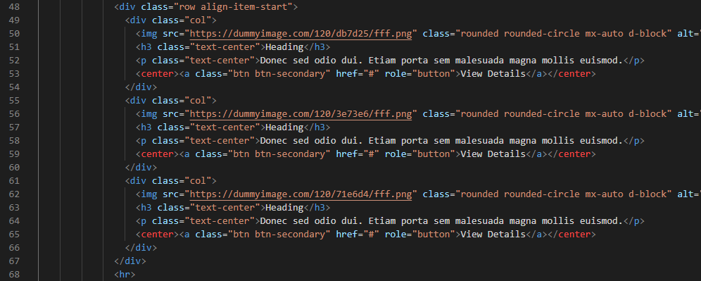 
Maka hasilnya akan seperti ini: 
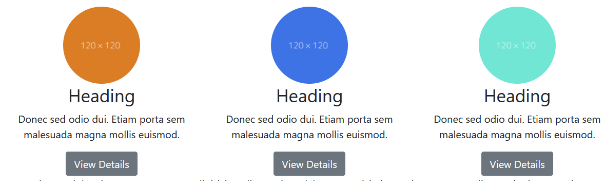 
## 5.Selanjutnya kita tambahkan 2 artikel lagi dibagian bawah lingkaran
dan kita buat htmlnya seperti ini: 
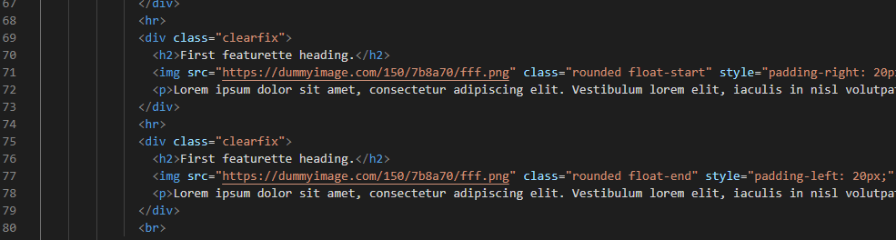 
Maka hasilnya akan seperti ini: 
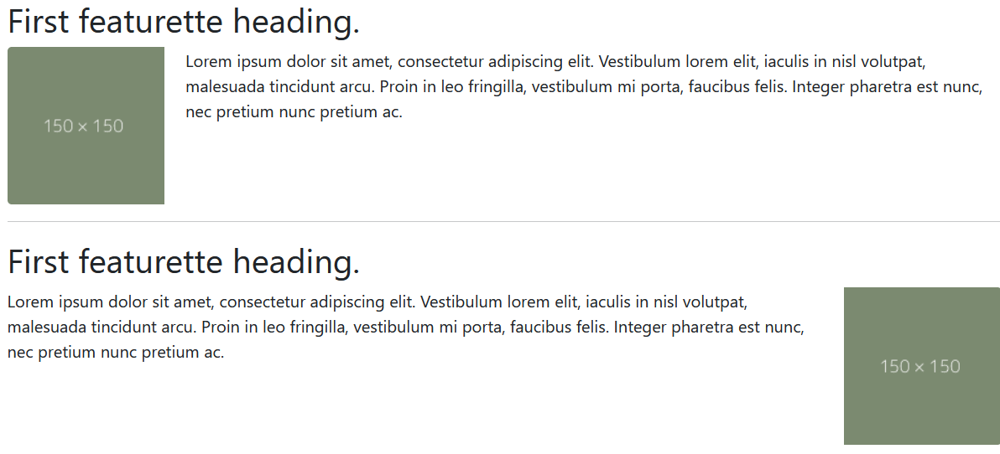 
## 6.Selanjutnya kita lanjut ke bagian sidebar
dan kita buat htmlnya seperti ini: 
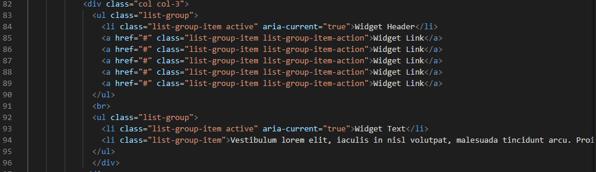 
Maka hasilnya akan sepeti ini: 
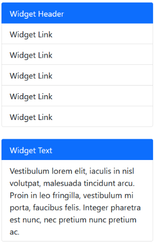 
## Terakhir kita buat footernya
dan kita buat htmlnya seperti ini: 
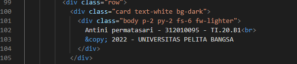 
Maka hasilnya akan seperti ini: 
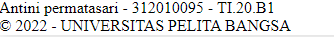 
Dibawah ini ada hasil final dari tugas pratikum 6 Lab6web 
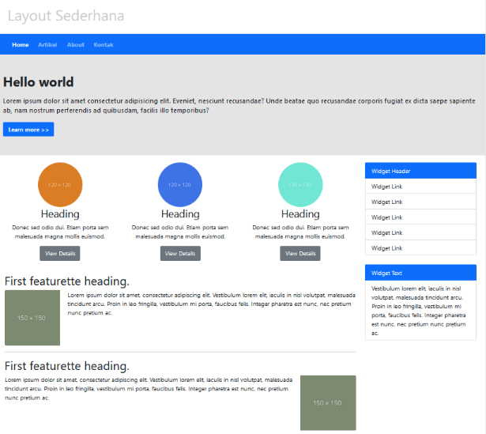 

Sekian dari saya, kurang Lebih nya mohon maaf 
Terimaksih..... 
Nama    : Antini permatasari 
NIM     : 312010095 
Kelas   : TI.20.B.1 

## pratikum 6 
## 1.Langkah pertama kita harus membuat Lab6web didalam folder itu kita harus terdapat 2 folder. 
yaitu : Gambar untuk menyimpan screenshot dan Lab6_css_framework untuk folder bootstrap.html dan css. 
Selanjutnya kita akan membuat htmlnya: 
 
## 2.Dan selanjunya kita membuka file explorer dan kita lihat gambarnya seperti dibawah ini: 
 
lalu kita tambahkan header dan juga navbarnya seperti dibawah ini : 
 
Maka hasilnya akan seperti ini: 
 
Lalu kita akan membuat heronya seperti ini: 
 
Maka hasilnya akan seperti ini : 
 
## 3.Selanjunya kita membuat html cssnya seperti ini: 
 
kemudian kita tambahkan link pada bagian bawah boostrap seperti dibawah ini: 
 
Maka kita lihat hasilnya ini: 
 
## 4.Selanjunya kita akan menambahkan 3 buah Lingkaran 
dan kita buat htmlnya seperti ini: 
 
Maka hasilnya akan seperti ini: 
 
## 5.Selanjutnya kita tambahkan 2 artikel lagi dibagian bawah lingkaran
dan kita buat htmlnya seperti ini: 
 
Maka hasilnya akan seperti ini: 
 
## 6.Selanjutnya kita lanjut ke bagian sidebar
dan kita buat htmlnya seperti ini: 
 
Maka hasilnya akan sepeti ini: 
 
## Terakhir kita buat footernya
dan kita buat htmlnya seperti ini: 
 
Maka hasilnya akan seperti ini: 
 
Dibawah ini ada hasil final dari tugas pratikum 6 Lab6web 
 

Sekian dari saya, kurang Lebih nya mohon maaf 
Terimaksih..... 
